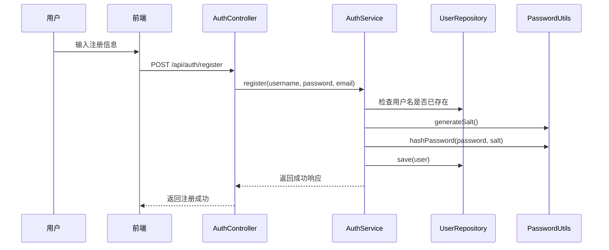
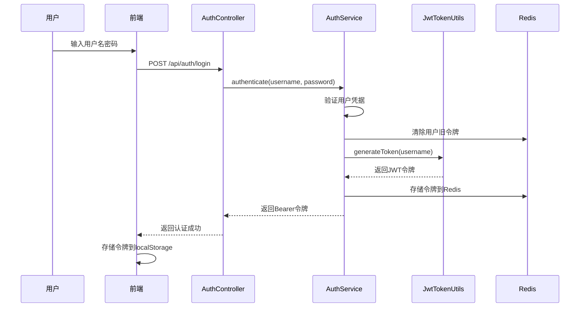
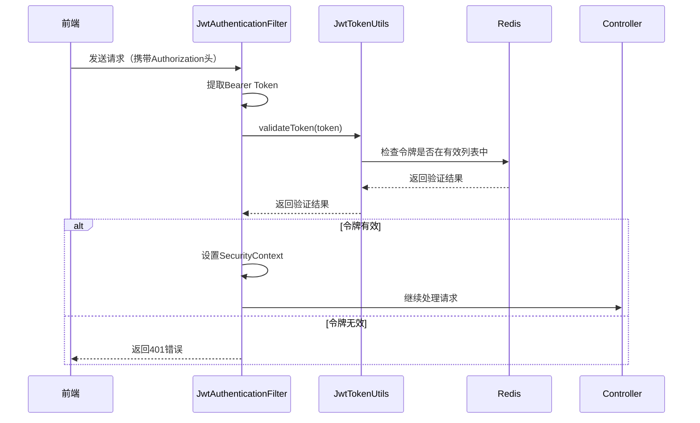

# JWT认证系统实现说明

## 系统概述

本项目已成功实现基于JWT（JSON Web Token）的无状态认证系统，替代了原有的Session-based认证方式。JWT认证提供了更好的可扩展性和跨域支持。

## 技术架构

### 核心组件
- **JwtTokenUtils**: JWT令牌的生成、解析和验证
- **JwtAuthenticationFilter**: 请求拦截器，验证JWT令牌
- **AuthService**: 认证服务，处理登录注册逻辑
- **SecurityConfig**: Spring Security配置，集成JWT认证
- **Redis**: 用于存储有效令牌，支持令牌黑名单功能

### 依赖配置
```xml
<dependency>
    <groupId>io.jsonwebtoken</groupId>
    <artifactId>jjwt-api</artifactId>
    <version>0.11.5</version>
</dependency>
<dependency>
    <groupId>io.jsonwebtoken</groupId>
    <artifactId>jjwt-impl</artifactId>
    <version>0.11.5</version>
</dependency>
<dependency>
    <groupId>io.jsonwebtoken</groupId>
    <artifactId>jjwt-jackson</artifactId>
    <version>0.11.5</version>
</dependency>
```

## JWT配置

### 配置文件 (application.yml)
```yaml
jwt:
  secret: "mySecretKey"  # JWT签名密钥
  expiration: 86400000   # 令牌过期时间（毫秒），默认24小时
```

### JwtConfig配置类
- 自动生成安全的签名密钥
- 支持自定义密钥和过期时间
- 使用SHA-512算法确保密钥安全性

## 认证流程

### 1. 用户注册流程


### 2. 用户登录流程


### 3. 请求认证流程


## 核心实现

### 1. JwtTokenUtils - 令牌工具类
```java
@Component
public class JwtTokenUtils {
    // 生成JWT令牌
    public String generateToken(String username)
    
    // 从令牌中提取用户名
    public String getUsernameFromToken(String token)
    
    // 验证令牌有效性
    public boolean validateToken(String token)
    
    // 清理令牌字符串
    private String cleanToken(String token)
}
```

**关键特性：**
- 使用HS512算法签名
- 支持Bearer前缀自动清理
- 集成Redis验证令牌有效性
- 异常处理和日志记录

### 2. JwtAuthenticationFilter - 认证过滤器
```java
@Component
public class JwtAuthenticationFilter extends OncePerRequestFilter {
    @Override
    protected void doFilterInternal(HttpServletRequest request, 
                                  HttpServletResponse response, 
                                  FilterChain filterChain)
}
```

**功能特性：**
- 自动提取Authorization头中的Bearer Token
- 验证令牌签名和过期时间
- 检查Redis中的令牌有效性
- 设置Spring Security上下文
- 统一的错误响应格式

### 3. AuthService - 认证服务
```java
@Service
public class AuthService {
    // 用户注册
    public ApiResponse<String> register(String username, String password, String email)
    
    // 用户认证
    public ApiResponse<String> authenticate(String username, String password)
}
```

**安全特性：**
- BCrypt密码哈希（强度12）
- 随机盐值生成
- 登录时清除旧令牌
- Redis令牌管理

## 前端集成

### 1. HTTP拦截器配置
```typescript
// 请求拦截器：自动添加JWT令牌
http.interceptors.request.use((config) => {
  const token = localStorage.getItem('token')
  if (token) {
    config.headers.Authorization = token
  }
  return config
})

// 响应拦截器：处理401错误
http.interceptors.response.use(
  (res) => res,
  (err) => {
    if (err.response?.status === 401) {
      localStorage.removeItem('token')
      window.location.href = '/login'
    }
    return Promise.reject(err)
  }
)
```

### 2. 登录处理
```typescript
async function doLogin() {
  const res = await login({ username, password })
  const token = res.data.data
  if (token) {
    localStorage.setItem('token', token)
    // 获取用户信息
    const userRes = await http.get('/user')
    auth.setUser(userRes.data.data)
    router.push('/editor')
  }
}
```

### 3. 路由守卫
```typescript
router.beforeEach(async (to) => {
  const protectedRoutes = ['/editor', '/code-history', '/profile']
  
  if (protectedRoutes.includes(to.path)) {
    const token = localStorage.getItem('token')
    if (!token) {
      return '/login'
    }
    // 验证用户信息...
  }
})
```

## 安全特性

### 1. 令牌安全
- **签名验证**: 使用HS512算法确保令牌完整性
- **过期控制**: 默认24小时过期时间
- **黑名单机制**: Redis存储有效令牌，支持主动失效
- **密钥安全**: 自动生成安全密钥，支持SHA-512扩展

### 2. 密码安全
- **BCrypt哈希**: 强度12的BCrypt算法
- **随机盐值**: 每个用户独立的盐值
- **密码验证**: 安全的密码比较机制

### 3. 会话管理
- **无状态设计**: 不依赖服务器Session
- **令牌刷新**: 支持令牌主动失效
- **跨域支持**: 适合微服务架构

## API接口

### 认证接口
- `POST /api/auth/register` - 用户注册
- `POST /api/auth/login` - 用户登录
- `POST /api/auth/logout` - 用户登出
- `GET /api/user` - 获取当前用户信息

### 请求格式
```json
// 注册请求
{
  "username": "testuser",
  "password": "password123",
  "email": "test@example.com"
}

// 登录请求
{
  "username": "testuser", 
  "password": "password123"
}
```

### 响应格式
```json
// 成功响应
{
  "code": 200,
  "message": "操作成功",
  "data": "Bearer eyJhbGciOiJIUzUxMiJ9..."
}

// 错误响应
{
  "code": 401,
  "message": "用户名或密码错误",
  "data": null
}
```

## 配置说明

### 1. 应用配置
```yaml
# JWT配置
jwt:
  secret: "your-secret-key"  # 生产环境请使用强密钥
  expiration: 86400000       # 24小时（毫秒）

# Redis配置
spring:
  data:
    redis:
      host: localhost
      port: 6379
      password: your-password
```

### 2. 安全配置
```java
@Configuration
@EnableWebSecurity
public class SecurityConfig {
    @Bean
    public SecurityFilterChain securityFilterChain(HttpSecurity http) {
        return http
            .csrf(csrf -> csrf.disable())
            .authorizeHttpRequests(reg -> reg
                .requestMatchers("/api/auth/**").permitAll()
                .requestMatchers("/ws/**").permitAll()
                .anyRequest().authenticated()
            )
            .addFilterBefore(jwtAuthFilter, UsernamePasswordAuthenticationFilter.class)
            .build();
    }
}
```

## 部署注意事项

### 1. 生产环境配置
- 使用强随机密钥（建议64字符以上）
- 配置HTTPS保护令牌传输
- 设置合适的令牌过期时间
- 配置Redis持久化

### 2. 安全建议
- 定期轮换JWT密钥
- 监控异常登录行为
- 实施令牌黑名单机制
- 配置CORS策略

### 3. 性能优化
- Redis连接池配置
- 令牌缓存策略
- 异步认证处理

## 测试验证

### 1. 功能测试
- [x] 用户注册功能
- [x] 用户登录功能
- [x] JWT令牌生成和验证
- [x] 受保护接口访问
- [x] 令牌过期处理
- [x] 登出功能

### 2. 安全测试
- [x] 密码哈希验证
- [x] 令牌签名验证
- [x] 过期令牌拒绝
- [x] 无效令牌处理
- [x] 跨域请求支持

### 3. 集成测试
- [x] 前端JWT集成
- [x] WebSocket认证
- [x] API接口认证
- [x] 路由守卫功能

## 总结

JWT认证系统已成功实现，提供了：

1. **无状态认证**: 不依赖服务器Session，支持水平扩展
2. **安全可靠**: BCrypt密码哈希 + JWT签名验证
3. **易于集成**: 标准Bearer Token格式，前端友好
4. **功能完整**: 注册、登录、登出、令牌验证全流程
5. **性能优化**: Redis缓存，异步处理

系统已准备好用于生产环境，建议根据实际需求调整令牌过期时间和安全策略。
