# 后端详细设计（C-CodeLab）

## 1. 技术选型与总体架构
- 运行时与框架：Java 17 + Spring Boot 3.x
- 安全：Spring Security 6 + JWT（jjwt）
- Web：Spring MVC（RESTful API） + Spring WebSocket
- 数据访问：Spring Data JPA（MySQL/TiDB）
- 缓存与消息：Redis（Lettuce）
- 异步：`@Async` + `ThreadPoolTaskExecutor` + `CompletableFuture`
- 构建与依赖：Maven

分层架构：Controller → Service → Repository → Domain；横切：Security、Validation、Logging、Exception Handling。

## 2. 模块划分
- 认证授权模块（Auth）：登录、注册、令牌签发/校验、匿名用户（可选）
- 代码处理模块（Code）：代码保存、编译执行、结果推送
- 执行记录模块（Result）：历史记录查询
- 基础设施模块（Infra）：数据存储、缓存、异步线程池、全局异常处理、WebSocket

## 3. 数据模型设计

### 3.1 E-R图设计

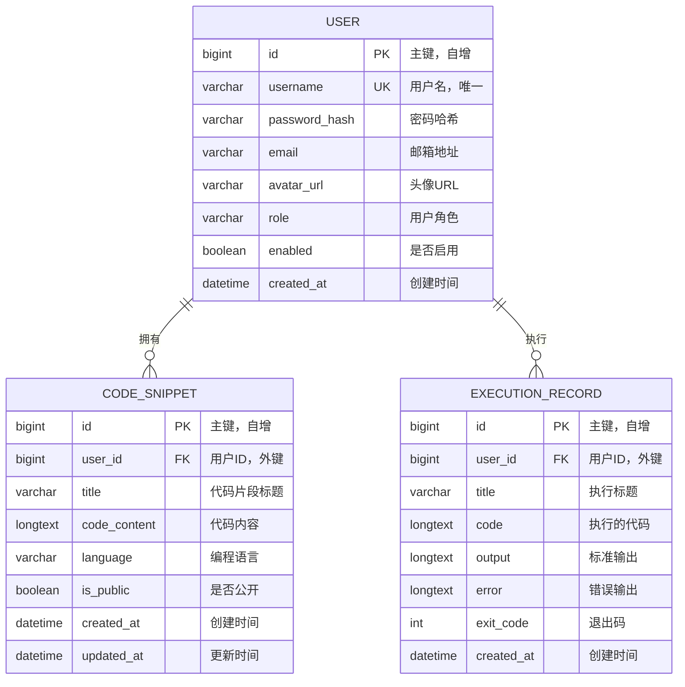

### 3.2 表结构详细设计

#### 3.2.1 用户表（user）

| 字段名 | 数据类型 | 长度 | 约束 | 默认值 | 说明 |
|--------|----------|------|------|--------|------|
| id | BIGINT | - | PK, AUTO_INCREMENT | - | 用户唯一标识 |
| username | VARCHAR | 64 | UNIQUE, NOT NULL | - | 用户名，全局唯一 |
| password_hash | VARCHAR | 120 | NOT NULL | - | BCrypt加密后的密码 |
| email | VARCHAR | 128 | NULL | NULL | 邮箱地址，可选 |
| avatar_url | VARCHAR | 255 | NULL | NULL | 头像URL，可选 |
| role | VARCHAR | 32 | NOT NULL | 'ROLE_USER' | 用户角色 |
| enabled | BOOLEAN | - | NOT NULL | TRUE | 账户是否启用 |
| created_at | DATETIME | - | NOT NULL | CURRENT_TIMESTAMP | 账户创建时间 |

**索引设计：**
- `PRIMARY KEY (id)` - 主键索引
- `UNIQUE KEY idx_username (username)` - 用户名唯一索引
- `KEY idx_created_at (created_at)` - 创建时间索引
- `KEY idx_role (role)` - 角色索引
- `KEY idx_enabled (enabled)` - 启用状态索引

#### 3.2.2 代码片段表（code_snippet）

| 字段名 | 数据类型 | 长度 | 约束 | 默认值 | 说明 |
|--------|----------|------|------|--------|------|
| id | BIGINT | - | PK, AUTO_INCREMENT | - | 片段唯一标识 |
| user_id | BIGINT | - | FK, NOT NULL | - | 所属用户ID |
| title | VARCHAR | 128 | NOT NULL | - | 代码片段标题 |
| code_content | LONGTEXT | - | NOT NULL | - | 代码内容 |
| language | VARCHAR | 16 | NOT NULL | 'c' | 编程语言 |
| is_public | BOOLEAN | - | NOT NULL | FALSE | 是否公开 |
| created_at | DATETIME | - | NOT NULL | CURRENT_TIMESTAMP | 创建时间 |
| updated_at | DATETIME | - | NOT NULL | CURRENT_TIMESTAMP ON UPDATE | 更新时间 |

**索引设计：**
- `PRIMARY KEY (id)` - 主键索引
- `KEY idx_user_id (user_id)` - 用户ID索引
- `KEY idx_created_at (created_at)` - 创建时间索引
- `KEY idx_title (title)` - 标题索引
- `KEY idx_user_created (user_id, created_at)` - 用户+时间复合索引
- `KEY idx_language (language)` - 语言索引
- `KEY idx_public (is_public)` - 公开状态索引
- `FOREIGN KEY fk_code_snippet_user (user_id) REFERENCES user(id) ON DELETE CASCADE` - 外键约束

#### 3.2.3 执行记录表（execution_record）

| 字段名 | 数据类型 | 长度 | 约束 | 默认值 | 说明 |
|--------|----------|------|------|--------|------|
| id | BIGINT | - | PK, AUTO_INCREMENT | - | 记录唯一标识 |
| user_id | BIGINT | - | FK, NOT NULL | - | 执行用户ID |
| title | VARCHAR | 128 | NULL | NULL | 执行标题 |
| code | LONGTEXT | - | NULL | NULL | 执行的代码内容 |
| output | LONGTEXT | - | NULL | NULL | 标准输出 |
| error | LONGTEXT | - | NULL | NULL | 错误输出 |
| exit_code | INT | - | NULL | NULL | 程序退出码 |
| created_at | DATETIME | - | NOT NULL | CURRENT_TIMESTAMP | 执行时间 |

**索引设计：**
- `PRIMARY KEY (id)` - 主键索引
- `KEY idx_user_created (user_id, created_at)` - 用户+时间复合索引
- `KEY idx_exit_code (exit_code)` - 退出码索引
- `KEY idx_created_at (created_at)` - 创建时间索引
- `KEY idx_user_exit (user_id, exit_code)` - 用户+退出码复合索引
- `FOREIGN KEY fk_execution_record_user (user_id) REFERENCES user(id) ON DELETE CASCADE` - 外键约束

### 3.3 数据关系说明

#### 3.3.1 实体关系
- **用户（USER）** 与 **代码片段（CODE_SNIPPET）**：一对多关系
  - 一个用户可以拥有多个代码片段
  - 代码片段必须属于某个用户
  - 用户删除时，其代码片段级联删除

- **用户（USER）** 与 **执行记录（EXECUTION_RECORD）**：一对多关系
  - 一个用户可以有多条执行记录
  - 执行记录必须属于某个用户
  - 用户删除时，其执行记录级联删除

#### 3.3.2 业务约束
- **用户表约束**：
  - 用户名全局唯一
  - 密码必须经过BCrypt加密
  - 角色只能是预定义值（ROLE_USER, ROLE_ANONYMOUS）

- **代码片段表约束**：
  - 同一用户下标题必须唯一
  - 代码内容长度限制（10KB）
  - 语言类型限制（目前仅支持'c'）

- **执行记录表约束**：
  - 退出码：0表示成功，非0表示失败
  - 输出和错误信息大小限制（1MB）

### 3.4 性能优化策略

#### 3.4.1 索引优化
- **复合索引**：`(user_id, created_at)` 优化按用户查询最近记录
- **覆盖索引**：`(user_id, title)` 优化代码片段查询
- **部分索引**：`(exit_code)` 优化失败记录查询

#### 3.4.2 分区策略（可选）
```sql
-- 按年份分区执行记录表（MySQL 8.0+）
ALTER TABLE execution_record 
PARTITION BY RANGE (YEAR(created_at)) (
    PARTITION p2024 VALUES LESS THAN (2025),
    PARTITION p2025 VALUES LESS THAN (2026),
    PARTITION p_future VALUES LESS THAN MAXVALUE
);
```

#### 3.4.3 数据归档
- **执行记录归档**：超过1年的记录迁移到归档表
- **代码片段清理**：删除超过2年且未使用的私有片段
- **用户数据清理**：定期清理匿名用户的临时数据

## 4. 接口设计（与前端契约一致，统一 ` /api ` 前缀）
- 认证
  - `POST /api/auth/register`
    - 请求：`{ username, password, email? }`
    - 响应：`{ code, message?, data:{ accessToken, refreshToken? } }`
  - `POST /api/auth/login`
    - 请求：`{ username, password }`
    - 响应：同上
  - `GET /api/user`
    - 请求：无
    - 响应：`{ code, data:{ id, username, avatarUrl?, createdAt, email?, role } }`

- 代码
  - `POST /api/code/save`
    - 请求：`{ title, codeContent, language:'c', isPublic }`
    - 响应：`{ code, data:{ id, title, createdAt } }`
  - `POST /api/code/run`
    - 请求：`{ code, title? }`
    - 响应：`{ code, data:{ success, output, error, exitCode } }`

- 执行记录
  - `GET /api/result/list`
    - 响应：`{ code, data:[ { id, title, output, exitCode, createdAt } ] }`

- WebSocket
  - 端点：`/ws/execution-result`
  - 鉴权：握手头 `Authorization: Bearer <token>`；后端解析 JWT 绑定会话
  - 推送：`ExecutionResult` JSON `{ success, output, error, exitCode }`

## 5. 安全设计（Spring Security + JWT）
- 认证流程：
  - 登录时使用 `AuthenticationManager` 校验用户名/密码；成功后签发 `accessToken(15min)` 与可选 `refreshToken(7d)`
  - 请求经过 `JwtAuthenticationFilter`，从 `Authorization` 头解析 Bearer Token，校验签名、过期、黑名单
- 核心组件：
  - `CustomUserDetailsService`：按用户名加载用户，映射角色为 `ROLE_USER` 或 `ROLE_ANONYMOUS`
  - `JwtTokenProvider`：生成/校验/解析 JWT；含 `isTokenBlacklisted()` 检查
  - `SecurityConfig`：配置无权匿名访问的接口（登录、注册、静态资源、WS 握手可适度放行）
- 令牌黑名单：`Redis key=jwt:blacklist:<token>`，登出或强制失效时写入，过期与 access 对齐

## 6. 代码处理与执行设计
- 限制与防护：
  - 代码长度 ≤ 10KB；仅允许语言 `c`
  - 编译命令固定：`gcc -o <out> <src> -Wall -Wextra`，禁止自定义参数
  - 运行以低权限用户（如 `nobody`）执行；限制 CPU/内存/时长（ulimit/cgroup，部署侧落实）
  - 输出大小上限 1MB，超限报错
- 临时文件与隔离：
  - Linux 使用 `/dev/shm/code-env`（内存文件系统）；Windows/开发机回退至 `java.io.tmpdir`
- 异步执行：
  - `compileExecutor`、`runExecutor`、`websocketExecutor` 线程池隔离
  - `CompletableFuture` 串联编译与运行阶段
- 编译与运行超时：编译 10s、运行 5s；超时销毁进程
- 缓存：对相同代码的编译结果做 Redis 缓存（Key=SHA-256(code)），命中后可跳过编译

## 7. 服务与类设计（关键伪代码）
```java
@Service
public class CodeExecutionService {
  // 编译与运行入口，返回执行结果并通过 WS 推送
}

@Service
public class CodeSnippetService {
  // 保存/查询代码片段
}

@Service
public class AuthService {
  // 注册/登录，签发与刷新令牌
}

@Configuration
@EnableAsync
public class AsyncConfig {
  // compileExecutor / runExecutor / websocketExecutor
}

@Configuration
@EnableWebSocket
public class WebSocketConfig implements WebSocketConfigurer { }

@Component
public class ExecutionWebSocketHandler extends TextWebSocketHandler {
  // 握手鉴权、会话管理、结果推送
}
```

## 8. 异常与返回值规范
- 全局异常处理：`@ControllerAdvice` 统一包装 `{ code, message, data }`
  - 参数校验失败：`code=400`
  - 未认证：`code=401`
  - 无权限：`code=403`
  - 业务错误：`code=422`
  - 系统错误：`code=500`
- 日志：关键路径打印 `requestId`、用户 `userId`、耗时、出口码

## 9. 性能与稳定性
- 线程池参数：根据实例规格可调，默认 `compile(3/10)、run(5/20)、ws(2/5)`
- 连接池：DataSource、HTTP 客户端合理连接上限
- 分页：`/result/list` 支持 `page/size`（后续迭代）；当前返回最近 N 条
- 重试：编译偶发失败可小次数重试（如 1 次）

## 10. 运维与配置
- 配置项（application.yml）：
  - `jwt.secret`、`jwt.access-expiration`、`jwt.refresh-expiration`
  - `datasource`（TiDB/MySQL）与连接池参数
  - `redis` 连接信息（Lettuce）
  - `code.tempDir`（默认 `/dev/shm/code-env`）
- 观测：
  - 指标：执行成功率、平均编译/运行时长、超时/失败次数
  - 日志切分：按天/文件大小滚动

## 11. 与前端对齐要点
- 路径一致：`/api/auth/*`、`/api/code/*`、`/api/result/*`
- 字段一致：`camelCase`，`ExecutionResult` 结构 `{ success, output, error, exitCode }`
- WebSocket：端点一致、握手携带 `Authorization`，断线重连友好

## 12. 核心功能活动图

### 12.1 用户认证流程活动图

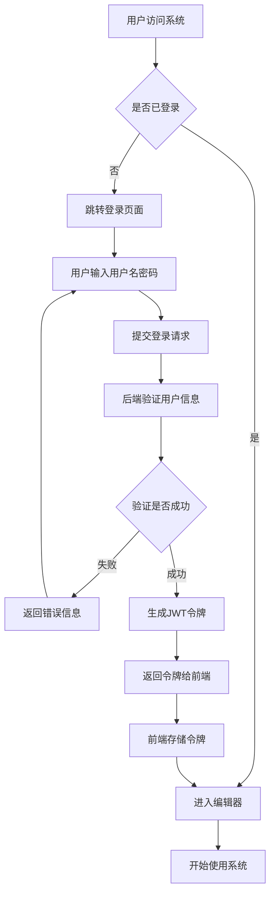

### 12.2 代码执行流程活动图

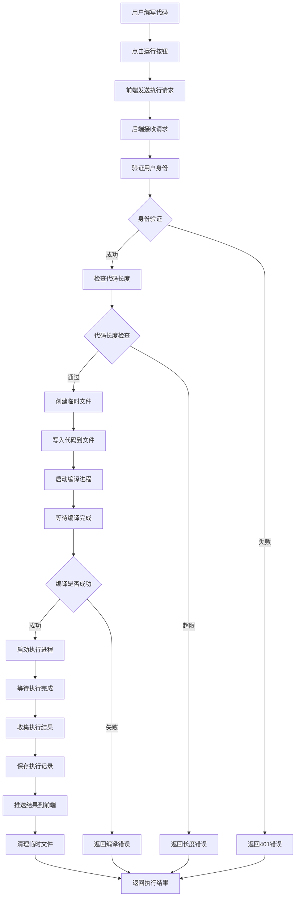

### 12.3 代码保存流程活动图

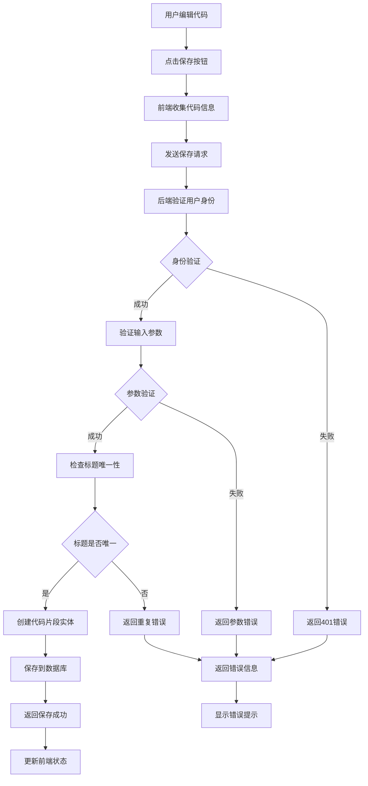

### 12.4 WebSocket推送流程活动图

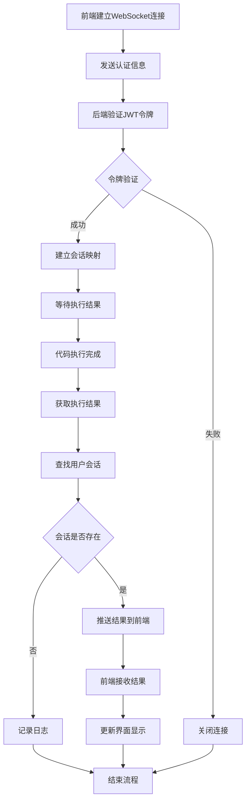

### 12.5 历史记录查询流程活动图

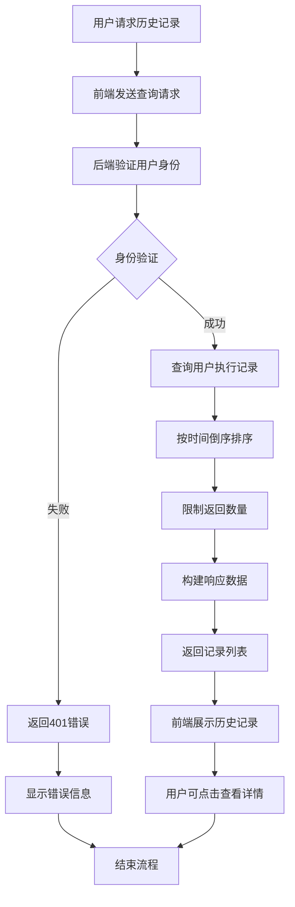

## 13. 核心功能时序图

### 13.1 用户认证时序图

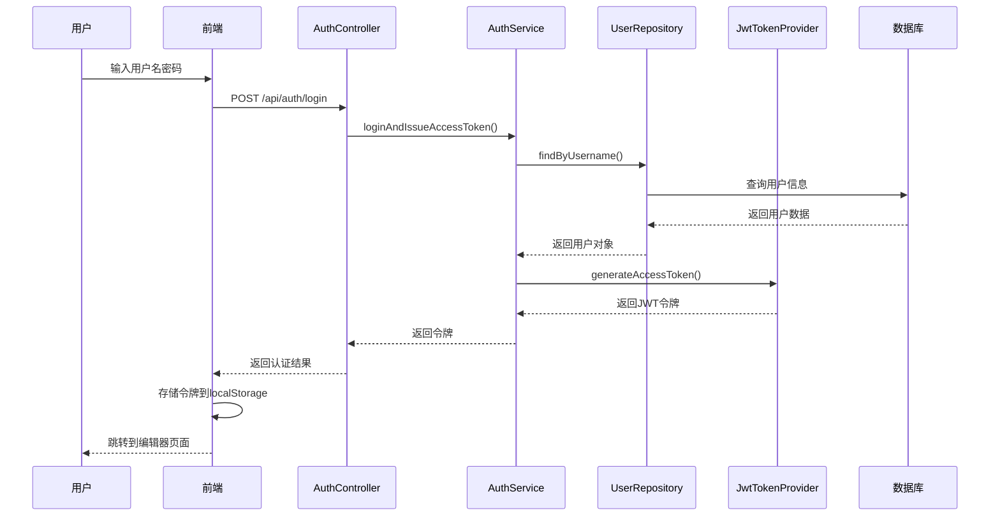

### 13.2 代码执行时序图

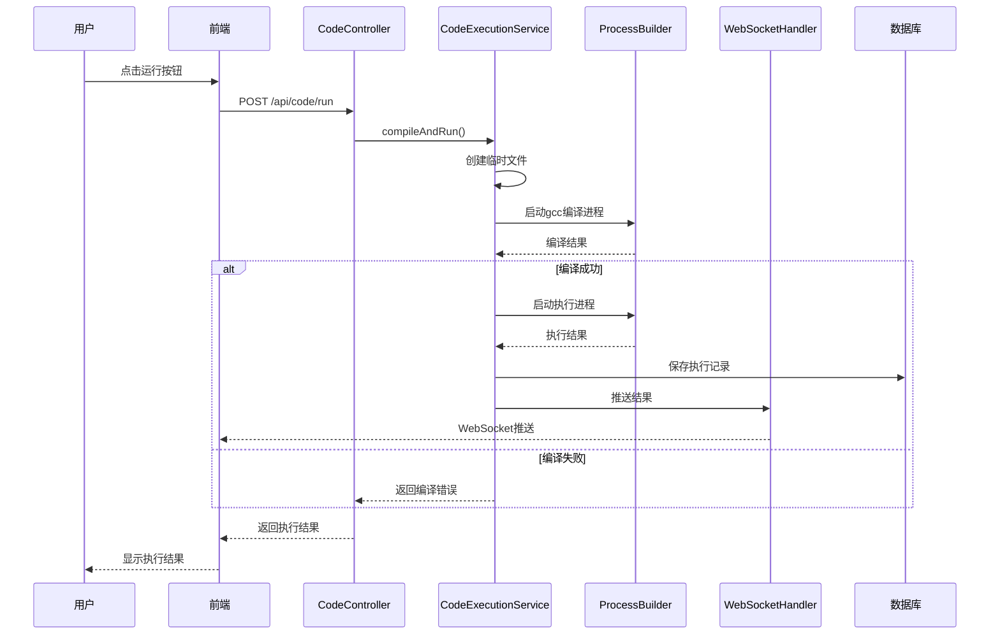

### 13.3 代码保存时序图

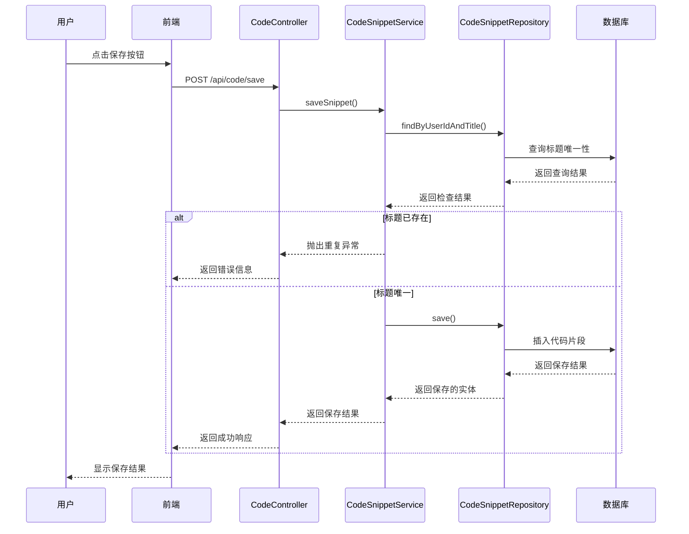

### 13.4 WebSocket推送时序图

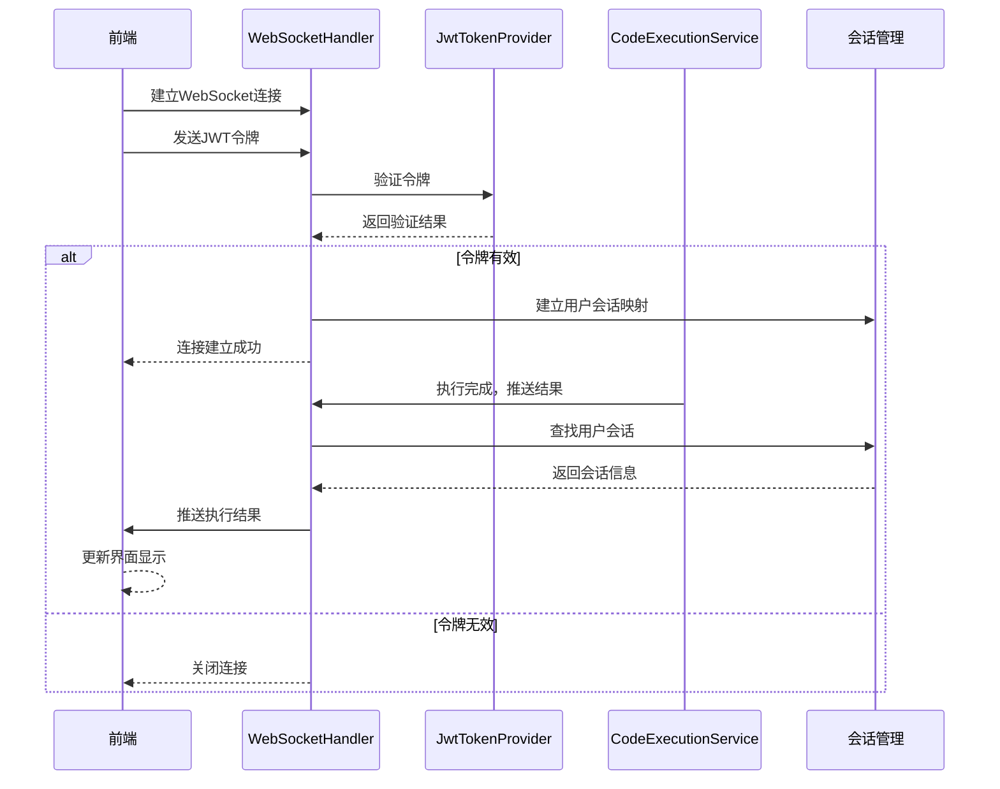

### 13.5 历史记录查询时序图

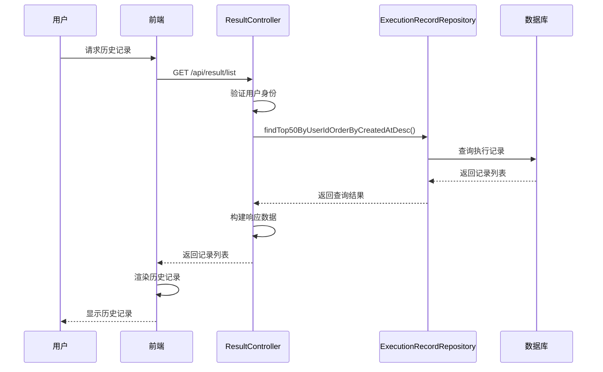

### 13.6 异步代码执行时序图

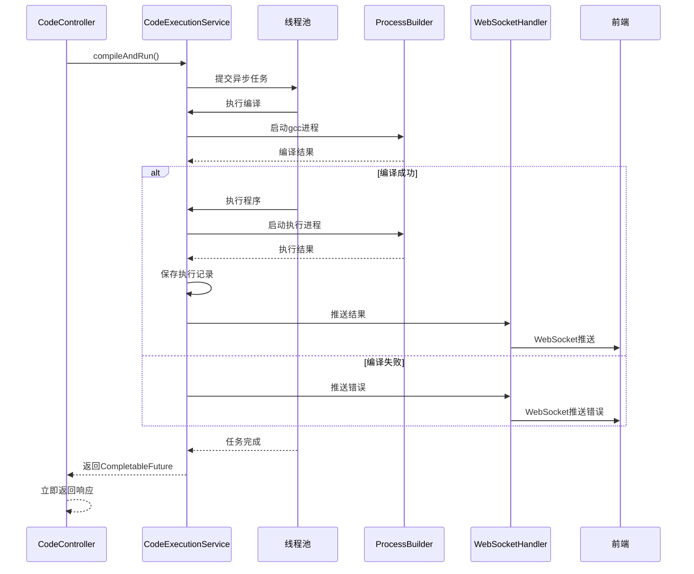

## 14. 后续扩展
- 匿名登录：默认 `ROLE_ANONYMOUS`，频控与权限隔离
- 刷新令牌：`POST /api/auth/refresh`，静默续期
- 沙箱强化：容器化隔离（nsjail/firejail/容器），资源配额细化
- 审计与灰度：执行动作审计、按用户/版本灰度线程池与超时参数


