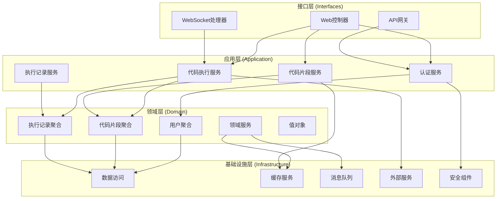
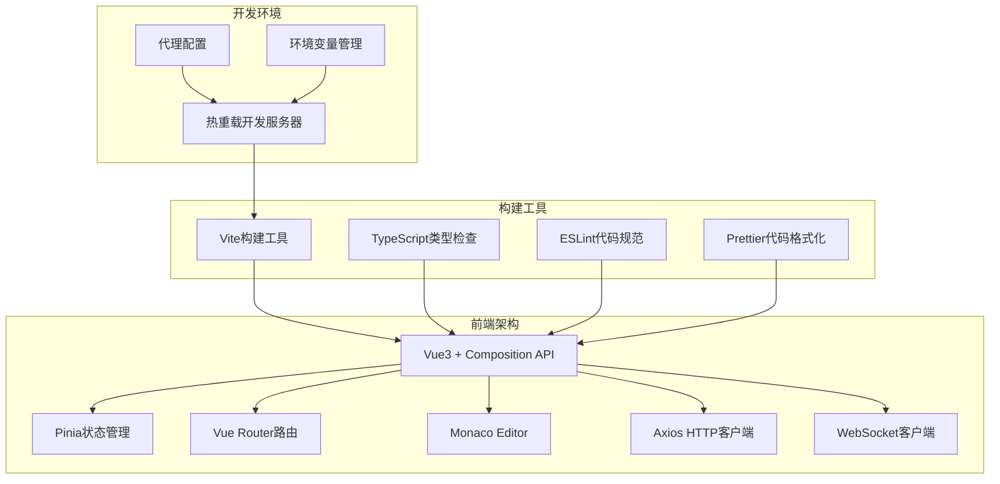
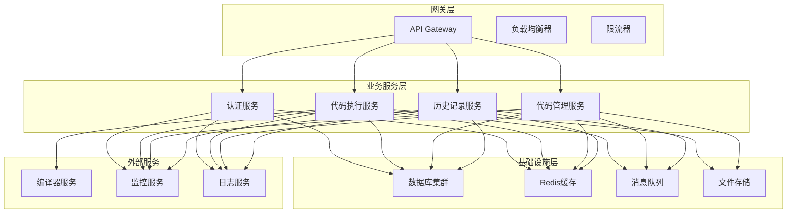

一、项目概况
摘要：

关键词：

二、选题依据
（一）项目意义

（二）国内外研究现状

三、研究方案
（一）研究目标
构建一套稳定、安全、易用的在线 C 语言代码编辑、编译与运行平台，实现浏览器端实时编码与结果回传；提供用户认证、代码片段管理与执行历史查询；满足教学演示与个人练习的轻量级场景，具备可扩展的安全沙箱与多语言支持能力。

（二）研究内容
1. 前端交互层：基于 Vue3 + Vite 集成 Monaco Editor，完成代码编辑、运行、结果展示、历史列表与鉴权流程。
2. 后端服务层：基于 Spring Boot 提供认证（JWT）、代码保存与编译运行接口，集成异步执行与结果推送（WebSocket）。
3. 数据持久层：设计并实现用户、代码片段、执行记录三类核心模型与索引优化，支持最近记录高效查询。
4. 安全与可靠性：输入校验、资源限额、黑名单令牌与审计日志；进程隔离与输出限流，避免滥用与逃逸风险。
5. 工程与运维：本地 H2/生产 MySQL(TiDB) 配置，Redis 缓存，日志与监控指标，前后端联调与自动化脚本。
6. 体验与可用性：错误高亮定位（结合编译器输出解析）、草稿自动保存、运行按钮节流、断线重连与状态提示。
7. 扩展性设计：多语言适配（C/C++ 扩展路径）、沙箱容器对接接口、可插拔的编译器路径与参数配置。

（三）拟解决的关键问题
1. 在线编译执行的安全边界：最小权限运行、CPU/内存/时长配额、输出限流、禁用任意参数注入与命令拼接。
2. 并发与响应：编译/运行异步化与线程池隔离，WebSocket 推送与 HTTP 同步返回的协调与降级策略。
3. 结果实时性与一致性：确保结果推送与历史记录持久化的一致性，避免重复推送或丢失。
4. 可用性与易用性：编辑体验（高亮、缩进、括号匹配）、编译错误定位与提示、失败重试与友好提示。
5. 数据一致性与性能：标题唯一性、最近记录分页与索引、热点用户的读写性能保障。

（四）拟采取的研究方法、技术路线、实验方案及可行性研究

1. 研究方法

1.1 需求驱动与快速原型迭代
采用敏捷开发理念，以用户故事为核心驱动开发过程。首先识别核心用户角色（学生、教师、开发者），梳理关键用户旅程：匿名访问→注册登录→代码编辑→编译运行→结果查看→历史管理。每个迭代周期（1-2周）完成一个完整功能模块，通过用户反馈快速调整需求优先级。建立最小可行产品（MVP）基线，逐步扩展功能边界。

1.2 领域驱动设计（DDD）架构分层

1.2.1 DDD架构图

1.2.2 架构分层详细说明

**领域层（Domain Layer）**
- **用户聚合（User Aggregate）**：包含用户实体、用户值对象（用户名、邮箱、角色），封装用户注册、登录、权限验证等业务规则
- **代码片段聚合（CodeSnippet Aggregate）**：管理代码片段的创建、更新、删除，确保标题唯一性约束，处理代码内容验证
- **执行记录聚合（ExecutionRecord Aggregate）**：记录代码执行历史，包含执行结果、错误信息、时间戳等
- **领域服务（Domain Services）**：处理跨聚合的业务逻辑，如代码执行权限验证、执行结果分析
- **值对象（Value Objects）**：不可变对象，如用户ID、代码语言类型、执行状态等

**应用层（Application Layer）**
- **认证服务（AuthService）**：协调用户注册、登录、令牌管理，调用领域层用户聚合
- **代码执行服务（CodeExecutionService）**：编排代码编译执行流程，处理异步执行、结果推送
- **代码片段服务（CodeSnippetService）**：管理代码片段的CRUD操作，处理业务规则验证
- **执行记录服务（ExecutionRecordService）**：管理执行历史查询、统计分析

**基础设施层（Infrastructure Layer）**
- **数据访问（Data Access）**：JPA Repository实现，数据库连接池管理，事务控制
- **缓存服务（Cache Service）**：Redis缓存实现，编译结果缓存，会话管理
- **消息队列（Message Queue）**：异步任务处理，执行结果推送
- **外部服务（External Services）**：编译器调用，文件系统操作，进程管理
- **安全组件（Security Components）**：JWT令牌处理，密码加密，权限验证

**接口层（Interfaces Layer）**
- **Web控制器（Web Controllers）**：RESTful API端点，请求参数验证，响应格式化
- **WebSocket处理器（WebSocket Handlers）**：实时通信处理，连接管理，消息路由
- **API网关（API Gateway）**：请求路由，负载均衡，限流控制

1.3 契约优先的接口设计
采用API-First设计理念，使用OpenAPI规范定义接口契约，确保前后端并行开发。通过接口模拟（Mock）技术，前端可在后端未完成时进行集成测试。建立接口版本管理机制，支持向后兼容的渐进式升级。

2. 技术路线

2.1 前端技术栈与架构设计

2.1.1 技术栈选型与架构图

2.1.2 核心模块设计

**用户界面层（UI Layer）**
- **登录组件（LoginView）**：用户认证界面，包含用户名/密码输入、表单验证、错误提示
- **编辑器组件（EditorView）**：主工作界面，集成代码编辑器、运行按钮、结果展示区
- **历史记录组件（HistoryList）**：执行历史列表，支持筛选、排序、详情查看

**状态管理层（State Management）**
- **认证状态（AuthStore）**：管理用户登录状态、JWT令牌、用户信息
- **代码状态（CodeStore）**：管理当前编辑代码、执行状态、运行结果
- **历史状态（HistoryStore）**：管理执行历史记录、分页信息

**服务层（Service Layer）**
- **认证服务（AuthService）**：处理登录、注册、令牌刷新
- **代码服务（CodeService）**：处理代码保存、执行、历史查询
- **WebSocket服务（WebSocketService）**：管理实时连接、消息推送

**工具层（Utils Layer）**
- **HTTP客户端（HttpClient）**：封装Axios，统一请求配置、拦截器
- **WebSocket客户端（WSClient）**：封装WebSocket连接、重连机制
- **错误处理（ErrorHandler）**：统一错误处理、用户提示

2.1.3 技术实现细节

**Vue3 Composition API架构**
- 使用`<script setup>`语法糖简化组件定义
- 通过`ref`、`reactive`、`computed`管理响应式状态
- 使用`watch`、`watchEffect`监听状态变化
- 通过`provide`/`inject`实现跨组件状态共享

**Pinia状态管理设计**
- 按功能模块划分Store：AuthStore、CodeStore、HistoryStore
- 使用TypeScript定义状态类型，确保类型安全
- 实现状态持久化，支持页面刷新后状态恢复
- 提供状态重置机制，支持用户登出时清理状态

**Monaco Editor集成方案**
- 配置C语言语法高亮和智能提示
- 实现错误标记功能，根据编译错误高亮对应代码行
- 支持代码折叠、自动缩进、括号匹配
- 提供主题切换功能，支持明暗主题

**路由与权限控制**
- 使用Vue Router实现单页应用路由
- 配置路由守卫，实现登录状态检查
- 支持路由懒加载，优化首屏加载性能
- 实现动态路由，根据用户权限显示不同菜单

2.2 后端微服务架构设计

2.2.1 微服务架构图

2.2.2 核心服务模块设计

**认证服务（Auth Service）**
- **功能模块**：用户注册、登录验证、令牌管理、权限控制
- **技术实现**：Spring Security + JWT，BCrypt密码加密，Redis令牌黑名单
- **接口设计**：POST /api/auth/register，POST /api/auth/login，GET /api/user
- **安全策略**：密码复杂度验证，登录失败锁定，令牌过期控制

**代码执行服务（Code Execution Service）**
- **功能模块**：代码编译、程序执行、结果收集、资源管理
- **技术实现**：Java ProcessBuilder，异步线程池，超时控制，输出限流
- **接口设计**：POST /api/code/run，WebSocket /ws/execution-result
- **安全策略**：进程隔离，资源限制，命令注入防护，临时文件清理

**代码管理服务（Code Management Service）**
- **功能模块**：代码片段CRUD，标题唯一性验证，代码内容校验
- **技术实现**：Spring Data JPA，数据库事务，输入验证
- **接口设计**：POST /api/code/save，GET /api/code/list，PUT /api/code/update
- **业务规则**：用户级别标题唯一性，代码长度限制，语言类型验证

**历史记录服务（History Service）**
- **功能模块**：执行记录存储，历史查询，统计分析
- **技术实现**：JPA Repository，分页查询，复合索引优化
- **接口设计**：GET /api/result/list，GET /api/result/statistics
- **性能优化**：按用户+时间复合索引，最近N条查询优化

2.2.3 基础设施组件设计

**数据访问层（Data Access Layer）**
- **技术选型**：Spring Data JPA + Hibernate，支持MySQL/TiDB
- **连接池配置**：HikariCP连接池，最大连接数50，最小空闲连接5
- **事务管理**：声明式事务，读写分离，分布式事务支持
- **缓存策略**：二级缓存，查询结果缓存，编译结果缓存

**缓存服务（Cache Service）**
- **技术选型**：Redis 6.x，Lettuce客户端，集群模式
- **缓存策略**：JWT令牌黑名单，编译结果缓存，用户会话缓存
- **过期策略**：令牌15分钟，编译结果1小时，会话7天
- **一致性保证**：缓存更新策略，分布式锁，消息通知

**消息队列（Message Queue）**
- **技术选型**：Redis Stream，支持消息持久化，消费者组
- **消息类型**：代码执行任务，结果推送通知，系统告警
- **处理策略**：异步处理，失败重试，死信队列
- **监控告警**：消息积压监控，处理延迟告警，消费者健康检查

**安全组件（Security Components）**
- **认证机制**：JWT无状态认证，令牌刷新机制，多端登录控制
- **授权策略**：基于角色的访问控制（RBAC），资源级权限控制
- **安全防护**：SQL注入防护，XSS攻击防护，CSRF防护
- **审计日志**：用户操作日志，安全事件日志，系统访问日志

2.3 代码执行引擎设计
构建安全的代码执行沙箱，通过进程隔离、资源限制、权限控制确保执行安全。使用Java ProcessBuilder启动外部进程，通过超时控制防止无限循环。实现输出流监控，防止内存溢出攻击。建立临时文件管理机制，确保执行环境的隔离性和清理的及时性。

2.4 数据存储与缓存策略
采用分层存储架构，热数据使用Redis缓存，冷数据存储到关系型数据库。设计复合索引优化查询性能，通过读写分离提升并发处理能力。建立数据归档机制，定期清理历史执行记录，保持系统性能。

2.5 实时通信与推送机制
基于WebSocket协议实现双向实时通信，支持代码执行状态的实时更新。设计断线重连机制，通过指数退避算法避免频繁重连。实现消息队列机制，确保重要消息的可靠传递。

3. 实验方案

3.1 功能完整性实验
设计端到端测试用例，覆盖用户注册、登录认证、代码编辑、编译执行、结果展示、历史查询等核心功能流程。建立自动化测试框架，支持回归测试和持续集成。通过用户验收测试（UAT）验证功能是否符合用户期望。

3.2 性能压力测试
使用JMeter等工具进行负载测试，模拟不同并发用户数（50、100、200、500）下的系统表现。监控关键性能指标：响应时间（P50、P95、P99）、吞吐量（TPS）、错误率、资源使用率（CPU、内存、磁盘、网络）。通过压力测试确定系统性能瓶颈，指导容量规划和优化方向。

3.3 稳定性与可靠性测试
进行长时间运行测试（24-72小时），验证系统在持续负载下的稳定性。监控内存泄漏、线程池耗尽、数据库连接池耗尽等问题。通过故障注入测试验证系统的容错能力和恢复能力。

3.4 安全性渗透测试
委托专业安全团队进行渗透测试，模拟各种攻击场景：SQL注入、XSS攻击、CSRF攻击、权限提升、代码注入等。通过安全扫描工具检测已知漏洞，建立安全基线。定期进行安全评估，确保系统安全防护的有效性。

3.5 兼容性测试
验证系统在不同操作系统（Windows 10/11）、浏览器（Chrome、Edge、Firefox）、编译器环境（MinGW、WSL、本地GCC）下的兼容性。建立兼容性测试矩阵，确保系统在各种环境下的正常运行。

3.6 用户体验测试
通过用户研究、可用性测试、A/B测试等方法评估用户体验。收集用户反馈，分析用户行为数据，持续优化界面设计和交互流程。建立用户体验指标体系，量化评估系统易用性。

4. 可行性研究

4.1 技术可行性分析
所选技术栈均为成熟稳定的开源技术，具有丰富的社区支持和文档资源。Spring Boot、Vue3、Monaco Editor等技术在业界广泛应用，技术风险较低。开发团队具备相关技术栈的开发经验，学习成本可控。

4.2 经济可行性评估
采用开源技术栈，无需支付昂贵的商业许可费用。部署成本相对较低，可通过云服务提供商快速搭建开发和生产环境。人力成本主要集中在开发和维护阶段，总体投入在可接受范围内。

4.3 时间可行性分析
项目开发周期为10周，时间安排合理。采用敏捷开发方法，通过迭代交付降低项目风险。关键路径分析显示，代码执行引擎和前端编辑器是技术难点，需要重点关注。

4.4 资源可行性评估
硬件资源需求适中，开发环境需要8核CPU、16GB内存，生产环境可根据用户规模弹性扩展。人力资源方面，需要前端开发、后端开发、测试工程师等角色，团队规模可控。

4.5 风险识别与应对
主要技术风险包括：代码执行安全、并发性能、浏览器兼容性等。通过技术预研、原型验证、分阶段实施等方式降低风险。建立风险监控机制，及时发现和应对潜在问题。

4.6 扩展性分析
系统架构支持水平扩展，可通过负载均衡、数据库分片、缓存集群等方式提升系统容量。接口设计遵循开放原则，支持第三方集成和功能扩展。技术选型具备良好的扩展性，可支持未来功能迭代和技术升级。

（五）研究计划及预期取得的研究成果
1. 研究计划
- 第1-2周：需求细化、总体与详细设计、技术选型与环境搭建；
- 第3-4周：后端认证与代码执行接口、数据模型与仓库、基础限额与线程池；
- 第5-6周：前端编辑器与页面联调、执行结果展示与历史列表、错误高亮；
- 第7周：WebSocket 推送、断线重连、可观测性完善（日志、指标、追踪）；
- 第8周：安全测试与性能压测、问题修复与文档完善、验收与答辩材料准备。

2. 预期取得的研究成果
- 一套可运行的在线 C 语言编译运行系统（前后端与脚本）；
- 项目文档（总体/详细设计、接口说明、运维与使用指南）；
- 性能与安全测试报告（指标与问题闭环）；
- 可复用的代码执行服务与安全限额中间件，具备多语言扩展接口。

四、研究基础
（一）已具备的实验条件和研究工作积累
- 硬件与操作系统：Windows 10/11 开发环境，8 核 CPU、16GB 内存及以上；
- 开发工具：JDK 17、Maven 3.9+、Node.js 18+、Vite、IDEA/VS Code；
- 编译环境：gcc（MinGW/或 WSL），已验证 PATH 可用；必要时配置 `code.gccPath`；
- 中间件与数据库：本地 H2（开发）、可切换 MySQL/TiDB（生产），Redis（云或本地）；
- 代码与规范：已完成总体/详细设计与基础代码骨架，统一编码风格与提交规范（Conventional Commits），Git 分支与 PR 流程；
- 自动化与代理：前端 Vite 代理 `/api` 与 `/ws` 指向后端，支持本地快速联调；
- 安全与合规模块：基础输入校验、JWT、令牌黑名单能力可用；
- 观测能力：日志规范与关键指标埋点方案已确定，便于后续接入监控平台。

（二）已取得的科研成果
- 体系化设计：完成系统架构、接口契约与实体模型设计，明确线程池与资源限额策略；
- 原型实现：后端骨架（认证/代码运行/数据模型/推送配置）与前端骨架（编辑器/鉴权/页面结构）已实现；
- 联调打通：本地代理、接口返回结构、状态管理与基本用例（登录-运行-查看）已跑通；
- 方法沉淀：通用编译执行与错误处理逻辑、输出限流方法、错误高亮方案，具备复用与扩展性；
- 风险清单：已识别主要风险（资源滥用、命令注入、长时间阻塞、推送丢失等）及对应对策，形成整改清单与验证计划。